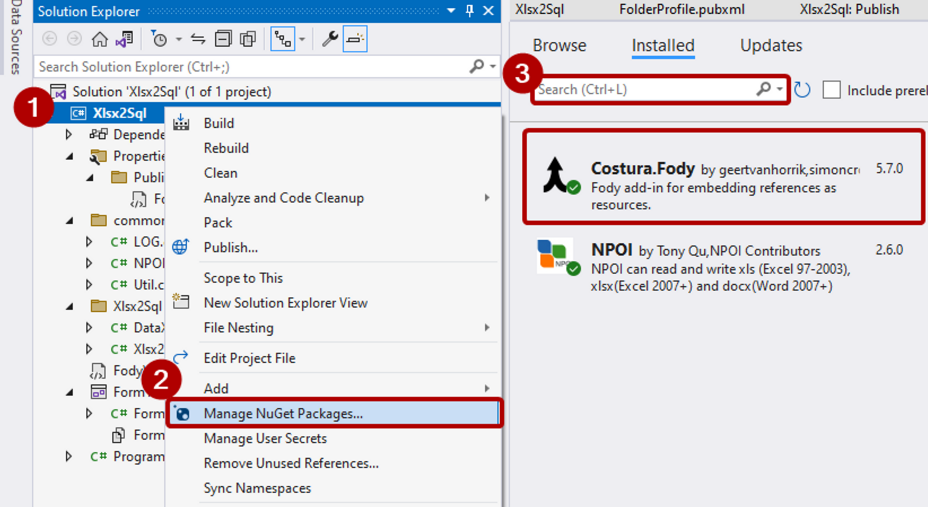

# Publish


1. Install Costura.Fody package on NuGet Packages manager

<figure><figcaption></figcaption></figure>

2. Edit FolderProfile.pub.xml

<figure><figcaption></figcaption></figure>

```xml
<IncludeAllContentForSelfExtract>true</IncludeAllContentForSelfExtract>
```

3. Right click from Project on Solution Explorer then, Select Publish menu
